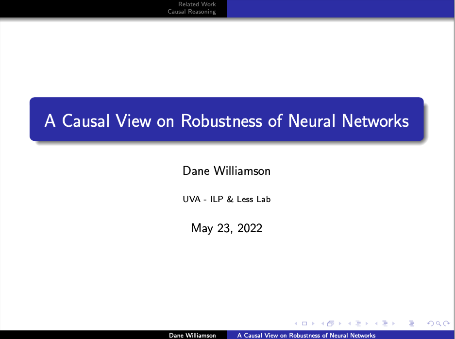

### Beamer Presentation Scaffolding  

This repo stores template LaTeX for a beamer doc. 

I recommend the usage of [Visual Studio Code](https://code.visualstudio.com/) with the [LaTex Workshop](https://marketplace.visualstudio.com/items?itemName=James-Yu.latex-workshop) extension.  

